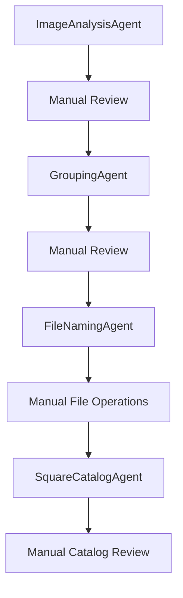

# Automation Workflow Audit

## Current State Analysis

### Existing Automated Workflows

#### ✅ **Image Upload Pipeline**
- **Agent**: `SquareCatalogAgent`
- **Scripts**: `direct-attach-to-guitar.js`, `unified-image-uploader.js`
- **Automation Level**: 95% - Fully automated with direct attachment method
- **Manual Steps**: 
  - Selecting target catalog item ID
  - Organizing images into directories
  - Running script commands

#### ✅ **Image Analysis Pipeline**
- **Agent**: `ImageAnalysisAgent`
- **Automation Level**: 90% - Automated with OpenAI vision analysis
- **Manual Steps**:
  - Providing category hints
  - Reviewing low-confidence analysis results
  - Handling parsing failures

#### ⚠️ **Product Grouping Pipeline**
- **Agent**: `GroupingAgent`
- **Automation Level**: 60% - Currently using rule-based grouping
- **Manual Steps**:
  - Review grouping results
  - Adjust similarity thresholds
  - Manual intervention for ambiguous cases

#### ⚠️ **File Naming Pipeline**
- **Agent**: `FileNamingAgent`
- **Automation Level**: 70% - Generates names but requires manual application
- **Manual Steps**:
  - Reviewing generated filenames
  - Applying renames to actual files
  - Backup creation and validation

#### ✅ **Square Catalog Integration**
- **Agent**: `SquareCatalogAgent`
- **Automation Level**: 85% - Automated with comprehensive error handling
- **Manual Steps**:
  - Category creation decisions
  - Price setting
  - Inventory level management

### Manual Intervention Points

#### 🔴 **Critical Manual Steps**
1. **End-to-End Orchestration**
   - Each agent must be called separately
   - No unified workflow management
   - Results must be manually passed between agents

2. **Catalog Item Matching**
   - Manual selection of target items for image upload
   - No intelligent matching between analyzed products and existing catalog

3. **Category Management**
   - Categories must be created manually before assignment
   - No automated category detection or creation

4. **Inventory Monitoring**
   - No automated stock level tracking
   - No low-stock alerts or reordering triggers

5. **Error Recovery**
   - Failed operations require manual review and retry
   - No automated recovery strategies

#### 🟡 **Semi-Manual Steps**
1. **Quality Assurance**
   - Low-confidence analysis results flagged for review
   - Filename generation requires approval before application
   - Batch operations need progress monitoring

2. **Configuration Management**
   - Agent parameters must be manually tuned
   - Performance thresholds require periodic adjustment

### Agent Boundaries and Integration Points

#### Current Agent Interaction Model

#### Integration Gaps
1. **No Direct Agent Communication**
   - Agents don't pass data directly to each other
   - All communication happens through manual script orchestration

2. **No Shared State Management**
   - Each agent maintains its own state
   - No centralized progress tracking

3. **No Error Propagation**
   - Errors in one agent don't automatically trigger recovery in others
   - No cascading error handling

### Performance Bottlenecks

#### 🐌 **Current Bottlenecks**
1. **Manual Script Execution**
   - Each workflow step requires manual command execution
   - Context switching between different scripts

2. **File System Dependencies**
   - Multiple agents read/write to disk independently
   - No coordinated file operations

3. **API Rate Limiting**
   - No coordinated API usage across agents
   - Potential for hitting Square API limits

4. **Batch Size Limitations**
   - Each agent has different optimal batch sizes
   - No unified batch coordination

### Observability Gaps

#### 📊 **Missing Automation Metrics**
1. **End-to-End Pipeline Metrics**
   - No tracking of complete workflow execution time
   - No success rate for full pipeline runs

2. **Cross-Agent Performance**
   - No correlation between agent performance
   - Missing bottleneck identification

3. **Automation Effectiveness**
   - No measurement of manual intervention frequency
   - Missing automation success rates

### Security and Compliance Considerations

#### 🔒 **Current Security State**
- ✅ SECURITY.md document exists with best practices
- ✅ Environment variable management for API keys
- ⚠️ No automated dependency vulnerability scanning
- ⚠️ No automated security policy enforcement

### Recommendations for Automation Enhancement

#### 🎯 **Priority 1: Pipeline Orchestration**
1. Create `InventoryAutomationOrchestrator` class
2. Implement workflow state management
3. Add cross-agent communication protocols

#### 🎯 **Priority 2: Smart Matching**
1. Implement fuzzy matching algorithms
2. Add machine learning for catalog item prediction
3. Create automated decision thresholds

#### 🎯 **Priority 3: Error Recovery**
1. Add automated retry strategies
2. Implement fallback mechanisms
3. Create error escalation workflows

#### 🎯 **Priority 4: Monitoring and Alerts**
1. Implement inventory level monitoring
2. Add automated alert systems
3. Create performance dashboards

### Success Metrics for Enhanced Automation

#### 📈 **Target Metrics**
- **Manual Intervention Rate**: < 5% (currently ~40%)
- **End-to-End Success Rate**: > 95% (currently requires manual steps)
- **Processing Time**: < 2 minutes per image (currently varies)
- **Error Recovery Rate**: > 90% automated (currently 0%)

### Implementation Roadmap

#### Phase 1: Foundation (Weeks 1-2)
- Implement `InventoryAutomationOrchestrator`
- Create unified configuration management
- Add cross-agent communication protocols

#### Phase 2: Intelligence (Weeks 3-4)
- Implement smart catalog matching
- Add automated category detection
- Enhance error recovery mechanisms

#### Phase 3: Monitoring (Weeks 5-6)
- Implement inventory level monitoring
- Add automated alerting systems
- Create performance dashboards

#### Phase 4: Optimization (Weeks 7-8)
- Implement adaptive batch processing
- Add machine learning improvements
- Optimize end-to-end performance

---

This audit provides the foundation for transforming the current collection of individual agents into a fully automated inventory management system with minimal manual intervention.
